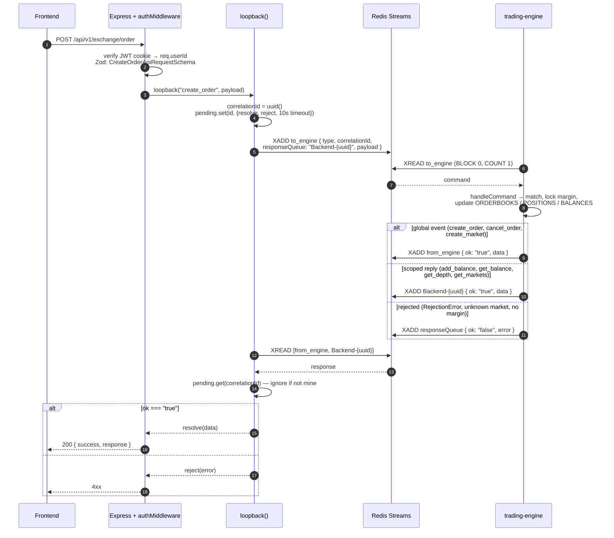
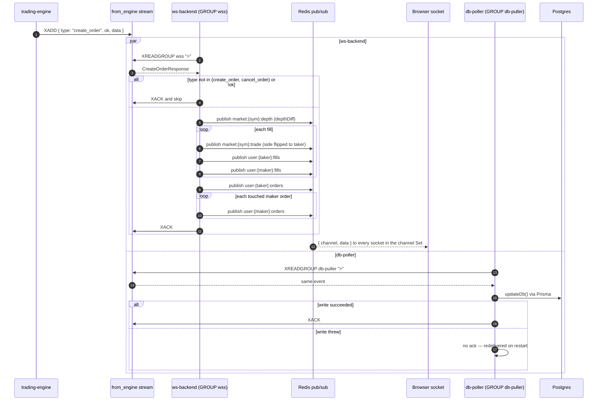
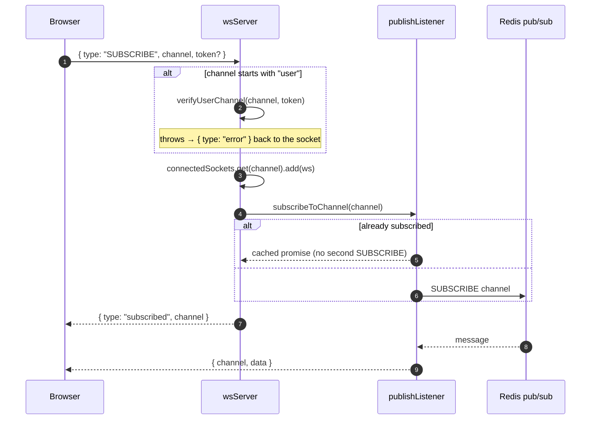
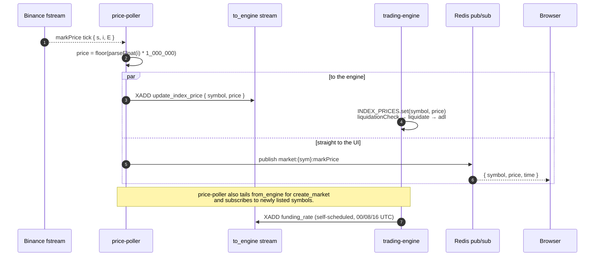

# exchanges

A perpetual-futures exchange built as a Turborepo monorepo: an in-memory matching engine driven by Redis Streams, an HTTP API, a WebSocket fan-out server, a Binance mark-price feeder, and a database writer — plus a React trading UI.

The engine is the single source of truth for orderbooks, balances, and positions. Everything else talks to it by appending commands to a Redis stream and reading the events it emits, so the hot path never touches Postgres.

## Architecture

```
                 ┌──────────────┐
  browser  ────► │ http-backend │──┐  xAdd to_engine
                 └──────────────┘  │  (correlationId + responseQueue)
                                   ▼
  binance  ────► price-poller ──►  Redis Streams  ◄── funding-rate timer
  mark px         (also pubsub          │
                   markPrice)           ▼
                              ┌──────────────────┐
                              │  trading-engine  │  in-memory books,
                              │  single-threaded │  balances, positions,
                              └──────────────────┘  liquidation, ADL
                                       │ xAdd from_engine
                        ┌──────────────┴───────────────┐
                        ▼                              ▼
                  ws-backend                       db-poller
              (pub/sub → browsers)          (consumer group → Postgres)
```

- **Commands** go to the `to_engine` stream; the engine replies on a per-backend response queue (`Backend-<id>`) keyed by `correlationId`, so an HTTP request can block on its own answer.
- **Global events** (`create_order`, `cancel_order`, `create_market`) instead go to the `from_engine` stream, which multiple consumers read independently.
- **db-poller** reads `from_engine` with a consumer group and only acks after a successful write, so a crash replays rather than drops.
- **ws-backend** turns engine events into Redis pub/sub channels and fans them out to subscribed sockets.
- The engine snapshots state to `data/snapshots/` every 5 minutes and replays the stream from the snapshot's last-seen ID on boot.

## Request & response flow

### Placing an order — a synchronous reply over an async stream

The HTTP layer never calls the engine directly. `services/loopback.ts` mints a `correlationId`, parks a promise in a `Map` behind a **10 s timeout**, and writes the command to the `to_engine` stream. Each http-backend process generates its own `Backend-{uuid}` response queue at boot, so replicas never resolve each other's requests.



`update_index_price` returns nothing and is never published. Commands with an empty `responseQueue` (index prices, funding) are fire-and-forget — nobody is waiting on them.

### One event, two consumer groups

`create_order` lands on `from_engine` once and is read independently by ws-backend and db-poller. The browser gets its update off the pub/sub path; the durable write happens on a separate track and cannot delay it.



`publishListener` keeps exactly one Redis subscription per channel regardless of socket count; `wsServer` holds `channel → Set<WebSocket>` and drops dead sockets on send failure.

### Subscribing to a channel



On `close`, the socket is removed from every channel it joined and empty channel Sets are deleted.

### Mark price in, liquidation out

`price-poller` holds one Binance `fstream` connection and splits each tick two ways — the UI tick deliberately bypasses the engine so chart updates never queue behind order flow.



### Recovery

The engine writes a snapshot to `data/snapshots/` every 5 minutes, tagged with the last stream ID it consumed. On boot `loadSnapshot()` restores the maps and returns that ID, and the read loop resumes `XREAD` from there — replaying every command since, which is what makes an in-memory book safe to restart.

## Apps

| App | Port | What it does |
| --- | --- | --- |
| `apps/http-backend` | 3000 | REST API — auth (JWT in cookie), order entry, market data reads |
| `apps/trading-engine` | 4000 | Matching engine, margin, funding, liquidation, ADL, snapshots |
| `apps/price-poller` | 5000 | Binance `fstream` mark-price WS → engine + `markPrice` pub/sub |
| `apps/db-poller` | 6000 | Durable writer: engine events → Postgres/Prisma |
| `apps/ws-backend` | 8080 | WebSocket server, channel subscriptions, Redis pub/sub bridge |
| `apps/frontend` | 5173 | React 19 + Vite + Tailwind + Redux Toolkit + lightweight-charts |
| `apps/test` | — | Bun integration tests against the running stack |

Each service exposes `/api/status/healthz` and `/api/status/readyz` for k8s probes.

## Packages

| Package | Contents |
| --- | --- |
| `@repo/types` | Engine command/response types, Zod API schemas, `REDIS_KEYS` |
| `@repo/redis` | Shared `createClient` wrapper (`getRedisClient()`) |
| `@repo/db-prisma` | Prisma schema, migrations, generated client |
| `@repo/timescaledb` | `pg` pool + `fills_ts` hypertable writes for candles/trades |
| `@repo/ui`, `@repo/eslint-config`, `@repo/typescript-config` | Shared UI + tooling config |

Prices and quantities are integers throughout (mark prices are scaled by `1_000_000`) to avoid float drift in the matching path.

## HTTP API

Base path `/api/v1`.

**Auth** — `POST /auth/signup`, `POST /auth/signin`

**Exchange** (`/exchange`)

| Method | Route | Auth | Purpose |
| --- | --- | --- | --- |
| POST | `/onramp` | ✅ | Credit balance |
| POST | `/market` | ✅ | Create a market |
| POST | `/order` | ✅ | Place a limit or market order |
| POST | `/order/:id` | ✅ | Cancel an order |
| GET | `/markets` | — | List markets |
| GET | `/depth/:symbol` | — | Orderbook snapshot |
| GET | `/klines/:symbol` | — | Candles (`1m`–`1d`) from TimescaleDB |
| GET | `/ticker/:symbol` | — | Last price / 24h stats |
| GET | `/trades/:symbol` | — | Recent trades |
| GET | `/orders` | ✅ | Caller's orders |
| GET | `/fills` | ✅ | Caller's fills |
| GET | `/balance` | ✅ | Caller's balance |

## WebSocket

Connect to the ws-backend and send:

```json
{ "type": "SUBSCRIBE", "channel": "market:BTC:depth" }
```

`UNSUBSCRIBE` uses the same shape. `user:*` channels require a `token` field carrying the JWT.

Channels: `market:<SYMBOL>:depth`, `market:<SYMBOL>:trade`, `market:<SYMBOL>:markPrice`, `user:<userId>:orders`, `user:<userId>:fills`.

## Getting started

Requires [Bun](https://bun.sh) 1.3.9+ and Docker.

```sh
bun install

# Postgres (TimescaleDB) + Redis
docker compose -f docker/docker-compose.yml --env-file docker/.env up -d

# schema
bun run --filter @repo/db-prisma db:generate
bun run --filter @repo/db-prisma db:migrate

# everything, in watch mode
bun run dev
```

Run a single service with a Turborepo filter:

```sh
bun run dev --filter @repo/trading-engine
```

Other root scripts: `bun run build`, `bun run lint`, `bun run check-types`, `bun run format`.

### Environment

Each app reads its own `.env` (see the checked-in examples). The variables in play:

- `DATABASE_URL` — Postgres/TimescaleDB connection string
- `REDIS_URL` — Redis connection string
- `JWT_SECRET`, `ADMIN_SECRET` — auth secrets (http-backend, ws-backend)
- `PORT`, `WSS_PORT` — http-backend and ws-backend listen ports
- `PRICE_FEEDER_REST_FALLBACK` — price-poller REST fallback toggle
- `VITE_API_URL`, `VITE_WS_URL`, `API_PROXY_TARGET`, `WS_PROXY_TARGET` — frontend

## Kubernetes

`k8s/` holds a Deployment + Service per app, an nginx Ingress, and a Secret. Copy the example secret first, then let Skaffold build, deploy, and file-sync:

```sh
cp k8s/secret-example.yml k8s/secret.yml   # edit before using anywhere real
skaffold dev
```

Skaffold port-forwards the frontend to `localhost:5173` and ws-backend to `localhost:8080`. http-backend deployments run a Prisma migration init container on start.
