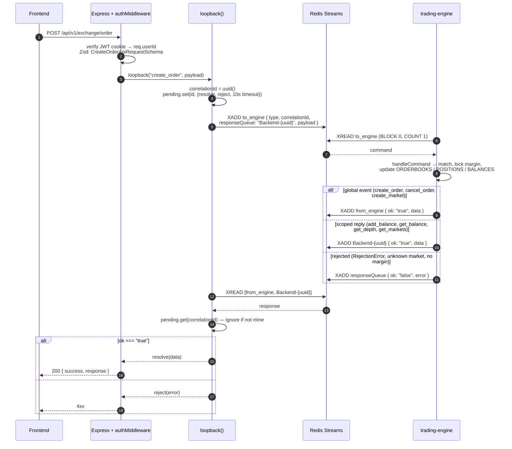
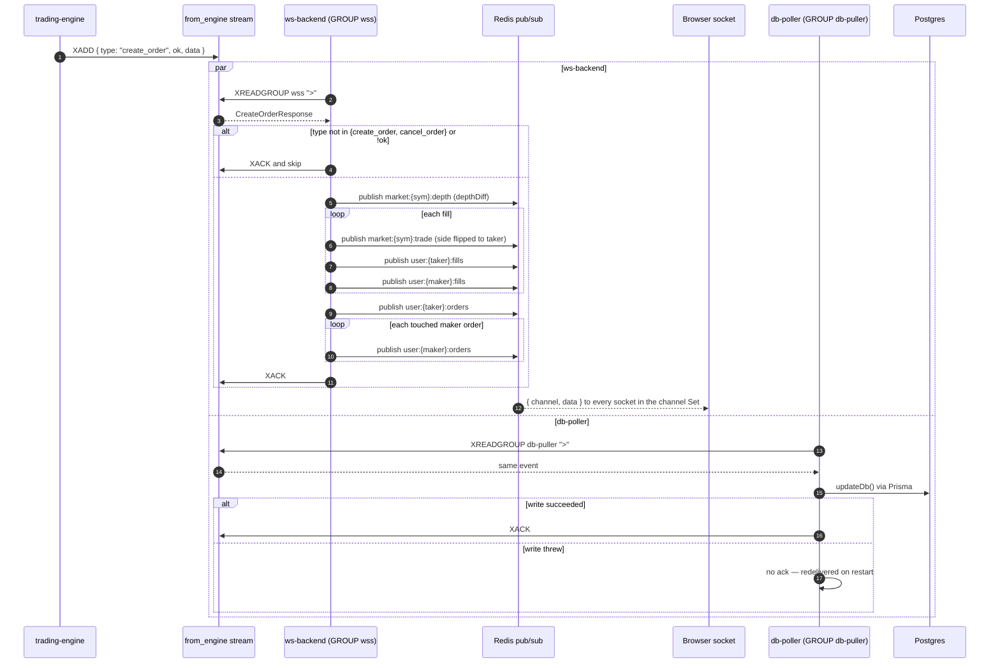
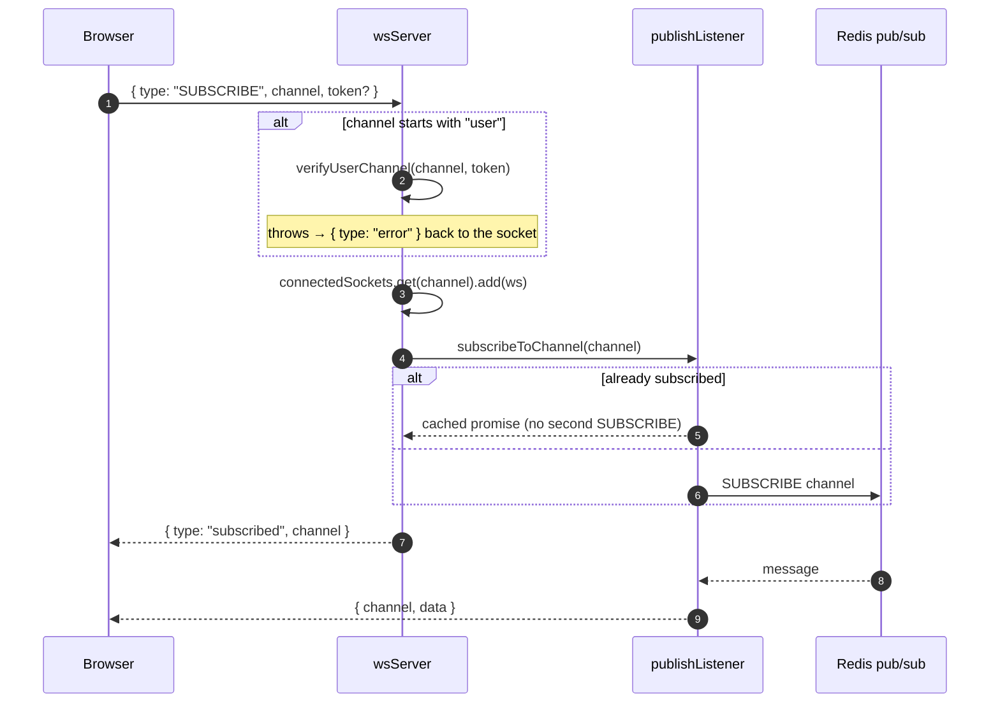
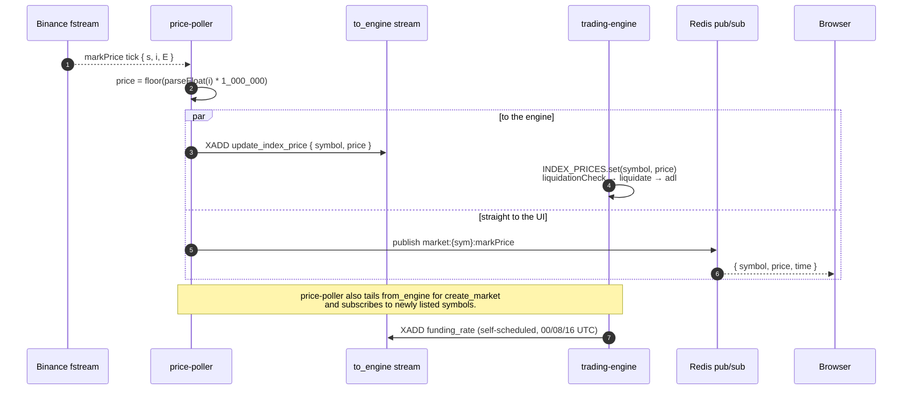

# hexfield-exchange

A perpetual-futures exchange — limit and market orders, cross-margin positions, funding, liquidation, and auto-deleveraging — built around a single-threaded in-memory matching engine.

You place an order over HTTP. The API doesn't touch the engine directly: it appends a command to a Redis stream and waits on a correlation ID. The engine matches in memory, emits an event, and two independent consumers pick it up — one fans it out to browsers over WebSocket, the other persists it to Postgres. The hot path never blocks on a database.

## How it works

```
POST /api/v1/exchange/order
        │
        ▼
  XADD to_engine  { correlationId, responseQueue, payload }
        │
        │  (single-threaded engine loop, XREAD BLOCK 0)
        ▼
  match      orderbook BTree → fills, margin locked, positions updated
        ▼
  emit       XADD from_engine (global) or XADD Backend-{uuid} (scoped reply)
        │
        ├──►  http-backend   resolves the pending promise → HTTP response
        ├──►  ws-backend     → Redis pub/sub → subscribed sockets
        └──►  db-poller      → Postgres via Prisma (acks only after the write)
```

The engine holds every orderbook, balance, and position in memory (`engine-store.ts`) and processes one command at a time, so matching, margin locking, and position updates can't interleave. Durability comes from replay: a snapshot every 5 minutes plus the command stream since that snapshot's ID.

Mark prices arrive on a separate path — `price-poller` streams Binance `fstream` ticks into the engine for liquidation checks and publishes the same tick straight to the UI, so chart updates never queue behind order flow.

## Request & response flow

### Placing an order — a synchronous reply over an async stream

The HTTP layer never calls the engine directly. `services/loopback.ts` mints a `correlationId`, parks a promise in a `Map` behind a **10 s timeout**, and writes the command to the `to_engine` stream. Each http-backend process generates its own `Backend-{uuid}` response queue at boot, so replicas never resolve each other's requests.



`update_index_price` returns nothing and is never published. Commands with an empty `responseQueue` (index prices, funding) are fire-and-forget — nobody is waiting on them.

### One event, two consumer groups

`create_order` lands on `from_engine` once and is read independently by ws-backend and db-poller. The browser gets its update off the pub/sub path; the durable write happens on a separate track and cannot delay it.



`publishListener` keeps exactly one Redis subscription per channel regardless of socket count; `wsServer` holds `channel → Set<WebSocket>` and drops dead sockets on send failure.

### Subscribing to a channel



On `close`, the socket is removed from every channel it joined and empty channel Sets are deleted.

### Mark price in, liquidation out



The engine writes a snapshot to `data/snapshots/` every 5 minutes, keeping the 10 most recent. On boot `loadSnapshot()` restores the maps and returns the last stream ID it had consumed, and the read loop resumes `XREAD` from there — which is what makes an in-memory book safe to restart.

## Stack

| Layer      | Choice                                                                |
| ---------- | --------------------------------------------------------------------- |
| Runtime    | Bun 1.3 (also the package manager)                                    |
| Monorepo   | Turborepo + Bun workspaces                                            |
| Services   | Express 5, six independently deployable apps                          |
| Transport  | Redis Streams (commands/events) + Redis pub/sub (fan-out), `ws`       |
| Frontend   | React 19, Vite, Tailwind v4, Redux Toolkit, lightweight-charts        |
| Database   | PostgreSQL + Prisma 7 (`@prisma/adapter-pg`), TimescaleDB for candles |
| Matching   | `sorted-btree` orderbooks, integer prices, in-process state           |
| Price feed | Binance USDⓈ-M `fstream` mark price WebSocket                         |
| Deploy     | Docker + Kubernetes, Skaffold for local dev                           |

## Repository layout

```
apps/
  http-backend/       REST API — auth, order entry, market data reads (:3000)
  trading-engine/     Matching, margin, funding, liquidation, ADL, snapshots (:4000)
  price-poller/       Binance mark-price feed → engine + pub/sub (:5000)
  db-poller/          Durable writer: engine events → Postgres (:6000)
  ws-backend/         WebSocket server + Redis pub/sub bridge (:8080)
  frontend/           React + Vite trading UI (:5173)
  test/               Bun integration tests that boot the stack
packages/
  types/              Engine types, Zod API schemas, REDIS_KEYS
  redis/              Shared Redis client factory
  db-prisma/          Prisma schema, migrations, generated client
  timescaledb/        pg pool + fills_ts hypertable writes
  ui/                 Shared React components
  eslint-config/      Shared ESLint configs
  typescript-config/  Shared tsconfig bases
data/snapshots/       Engine state snapshots (last 10)
docker/               docker-compose for local Postgres + Redis
k8s/                  Deployments, services, ingress, secrets
```

Every service exposes `/api/status/healthz` and `/api/status/readyz` for the Kubernetes probes.

## Getting started

Requires Bun 1.3+ and Docker.

```sh
git clone <repo-url> exchanges && cd exchanges
bun install
```

**1. Environment files**

Each app and each stateful package reads its own `.env` and throws on startup if a variable is missing. Dev values are checked in — replace them before running anywhere real.

| File                       | Variables                                                            |
| -------------------------- | -------------------------------------------------------------------- |
| `apps/http-backend/.env`   | `PORT`, `JWT_SECRET`, `ADMIN_SECRET`, `DATABASE_URL`, `REDIS_URL`    |
| `apps/ws-backend/.env`     | `WSS_PORT`, `JWT_SECRET`, `REDIS_URL`                                |
| `apps/trading-engine/.env` | `REDIS_URL`                                                          |
| `apps/price-poller/.env`   | `REDIS_URL`, `DATABASE_URL`, `PRICE_FEEDER_REST_FALLBACK`            |
| `apps/db-poller/.env`      | `REDIS_URL`, `DATABASE_URL`                                          |
| `apps/frontend/.env`       | `VITE_API_URL`, `VITE_WS_URL`, `API_PROXY_TARGET`, `WS_PROXY_TARGET` |
| `apps/test/.env`           | `TEST_API_PORT`, `JWT_SECRET`, `ADMIN_SECRET`                        |
| `packages/*/.env`          | `DATABASE_URL` / `REDIS_URL` for the shared clients                  |
| `docker/.env`              | `POSTGRES_USER`, `POSTGRES_PASSWORD`, `POSTGRES_DB`                  |

**2. Database**

```sh
docker compose -f docker/docker-compose.yml --env-file docker/.env up -d

cd packages/db-prisma
bun run db:generate     # generates the Prisma client — required before anything typechecks
bun run db:migrate
cd ../..
```

Postgres runs as `timescale/timescaledb:latest-pg16`; the `20260723000000_timescale_fills_and_candles` migration creates the `fills_ts` hypertable that backs `/klines` and `/trades`.

**3. Run**

```sh
bun run dev
```

That starts every workspace in watch mode:

| Service                    | Address                                        |
| -------------------------- | ---------------------------------------------- |
| `apps/frontend`            | http://localhost:5173                          |
| `apps/http-backend`        | http://localhost:3000 (`/api/v1`)              |
| `apps/ws-backend`          | ws://localhost:8080                            |
| `apps/trading-engine`      | no port — Redis consumer                       |
| `apps/price-poller`        | no port — upstream feed → Redis                |
| `apps/db-poller`           | no port — Redis → Postgres                     |
| Postgres (TimescaleDB)     | localhost:5432                                 |
| Redis                      | localhost:6379                                 |

## Commands

From the repo root:

```sh
bun run dev           # every app in watch mode
bun run build
bun run lint
bun run check-types
bun run format

turbo dev --filter=@repo/trading-engine    # a single workspace
```

Database, from `packages/db-prisma`:

```sh
bun run db:generate
bun run db:migrate
bun run db:studio
```

## Tests

`apps/test` uses Bun's built-in test runner against the real stack — it loads each app's `.env`, spawns http-backend and the trading engine itself, and drives them over HTTP, so Postgres and Redis must already be running. The suite walks a full flow: signup → signin → create market → onramp → place a limit order.

```sh
cd apps/test
bun test                                 # everything
bun test -t "places a limit order"       # one test by name
```

## API

All routes are prefixed with `/api/v1`. Authenticated routes read the JWT from the `token` cookie set at signin; `POST /exchange/market` additionally requires `ADMIN_SECRET` in a `token` header.

**Auth**

| Method | Route          | Notes                            |
| ------ | -------------- | -------------------------------- |
| POST   | `/auth/signup` | `username`, `password`, `email?` |
| POST   | `/auth/signin` | Sets the JWT cookie              |

**Exchange**

| Method | Route                      | Notes                                           |
| ------ | -------------------------- | ----------------------------------------------- |
| POST   | `/exchange/onramp`         | Credit balance · authenticated                  |
| POST   | `/exchange/market`         | Create a market · admin secret                  |
| POST   | `/exchange/order`          | Limit (`price`) or market (`slippageBps`) order |
| POST   | `/exchange/order/:id`      | Cancel an order · authenticated                 |
| GET    | `/exchange/markets`        | Public                                          |
| GET    | `/exchange/depth/:symbol`  | Orderbook snapshot from the engine              |
| GET    | `/exchange/klines/:symbol` | `1m`–`1d` candles from TimescaleDB              |
| GET    | `/exchange/ticker/:symbol` | Last price / 24h stats                          |
| GET    | `/exchange/trades/:symbol` | Recent trades                                   |
| GET    | `/exchange/orders`         | Caller's orders · authenticated                 |
| GET    | `/exchange/fills`          | Caller's fills · authenticated                  |
| GET    | `/exchange/balance`        | Caller's balance · authenticated                |

**Status** (unauthenticated, backs the Kubernetes probes)

`GET /api/status/healthz` · `GET /api/status/readyz` — on every service.

**WebSocket**

Subscribe with `{ "type": "SUBSCRIBE", "channel": "market:BTC:depth" }`; `UNSUBSCRIBE` uses the same shape. `user:*` channels require a `token` field carrying the JWT.

| Channel                     | Payload                                |
| --------------------------- | -------------------------------------- |
| `market:{symbol}:depth`     | `depthDiff` with update-ID sequencing  |
| `market:{symbol}:trade`     | One message per fill, taker side       |
| `market:{symbol}:markPrice` | Binance mark price, published directly |
| `user:{userId}:orders`      | Order state changes                    |
| `user:{userId}:fills`       | Fills, to both sides of the trade      |

Prices and quantities are integers everywhere — mark prices are scaled by `1_000_000` — so nothing in the matching path depends on float behaviour.

## Deployment

Each app has its own Dockerfile built from the repo root, and `skaffold.yml` builds all six images with file sync on `src/**`.

Local Kubernetes (requires a cluster with the nginx ingress controller):

```sh
cp k8s/secret-example.yml k8s/secret.yml   # fill in real values — this file is gitignored
skaffold dev
```

Skaffold applies everything under `k8s/`, runs Prisma migrations via a `db-migrate` init container on the http-backend deployment, and port-forwards the frontend to 5173 and ws-backend to 8080. The ingress routes `/ws` to ws-backend and everything else to http-backend, with cookie affinity so a session stays pinned to one replica.

## Notes and limits

- **The engine is one process by design.** All state is in memory and commands are handled serially, so it can't be scaled horizontally — replaying the same stream onto a second replica would double-count. Availability comes from fast restart-and-replay, not redundancy.
- **Snapshots bound the replay, not the loss.** State is durable only through the command stream; if `to_engine` is trimmed past the newest snapshot's last-seen ID, that gap can't be recovered.
- **Postgres lags the engine.** db-poller writes asynchronously, so a fill reaches the browser over WebSocket before it is queryable via `/orders` or `/fills`.
- **ws-backend acks stale pending entries on startup** instead of reprocessing them, so events in flight during a restart are dropped from the fan-out — db-poller still persists them.
- **Cookie affinity is load-bearing** for http-backend replicas: each process owns its `Backend-{uuid}` response queue and matches replies by correlation ID.
- **The Binance feed is unauthenticated** and has no reconnect/backoff loop yet; `PRICE_FEEDER_REST_FALLBACK` is validated at startup but not yet wired to a REST fallback.
- **Dev secrets are committed** in the `.env` files and `k8s/secret-example.yml`. They're placeholders for local work, not credentials.
